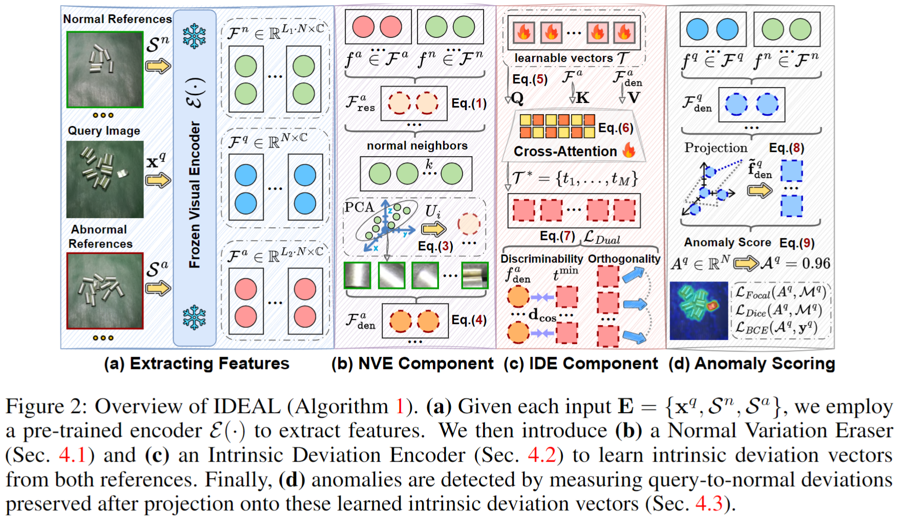

<div align="center">
  <h2><b>IDEAL: Intrinsic Deviation Learning for Discriminative FSAD</b></h2>
</div>

<div align="center">


[](https://opensource.org/licenses/Apache-2.0)

</div>

Official implementation of paper [Beyond Normal References: Discriminative Few-Shot Anomaly Detection](https://arxiv.org/abs/2605.23231).

## Overview

This paper considers a practical few-shot anomaly detection (FSAD) setting, termed **discriminative FSAD**, where a limited number of both normal and anomalous examples are available as references during inference. 
Existing FSAD methods rely on normal-only references through normality matching, ignoring the discriminative clues in anomalous references, while directly fitting both references can overfit to the seen anomalies. 
We introduce **IDEAL**, an **i**ntrinsic **de**vi**a**tion **l**earning framework that leverages both reference types to learn intrinsic deviation patterns characterizing generalizable abnormality as deviations from normality. 
IDEAL decomposes the learning process into two novel components: 1) a Normal Variation Eraser (NVE) to suppress nuisance normal variations that may lead to noisy deviations from normality, thereby highlighting anomaly-relevant deviation representations; 2) an Intrinsic Deviation Encoder (IDE) to decompose these denoised deviation representations into intrinsic deviation vectors capturing the most discriminative orthogonal deviation directions. At inference, IDEAL scores query-to-normal deviations preserved after projection onto the learned intrinsic deviation vectors, enabling generalization for both seen and unseen anomalies. The framework diagram of the proposed IDEAL is shown below:



## Setup Libraries

- python >= 3.10.11
- torch == 2.4.1
- torchvision == 0.19.1
- scipy == 1.7.3
- scikit-image == 0.19.2
- numpy >= 1.24.3
- tqdm >= 4.64.0
- transformers == 4.31.0

## Prepare Anomaly Detection Datasets and Weights

#### Step 1. Download Anomaly Detection Datasets
- **Industrial Anomaly Detection Datasets**: [MVTecAD](https://www.mvtec.com/company/research/datasets/mvtec-ad), [VisA](https://github.com/amazon-science/spot-diff), [AITEX](https://www.aitex.es/afid/), [BTAD](http://avires.dimi.uniud.it/papers/btad/btad.zip), [MPDD](https://github.com/stepanje/MPDD).
- **Medical Anomaly Detection Datasets**: [BraTS2021](https://www.kaggle.com/datasets/dschettler8854/brats-2021-task1), [Liver](https://drive.google.com/drive/folders/1AC-wWZl_K18CWL2eIxUScoSOoxT4IBuw?usp=sharing), [RESC](https://drive.google.com/drive/folders/1AC-wWZl_K18CWL2eIxUScoSOoxT4IBuw?usp=sharing).
- Please put these anomaly detection datasets in the `./dataset/data/` directory.

#### Step 2. Download Few-Shot Reference Samples
- **Normal Few-Shot Reference Samples**: The few-shot reference normal samples are used for normal-based FSAD methods at inference. Please download the few-shot normal reference samples from [Google Drive](https://drive.google.com/file/d/1H0vTqzZHeSOTMEnadKls22VnjLqF7V3h/view?usp=sharing) and put these data samples in the `./dataset/data/` directory.
- **Normal and Abnormal Few-Shot Reference Samples**: Please download the few-shot normal and abnormal reference samples from [Google Drive](https://drive.google.com/file/d/1FwzA6x7GnzD0zAtF8qmZ3Hx80lZIh8ce/view?usp=sharing) and put these data samples in the `./dataset/data/` directory. 

#### Step 3. Creating Json File for Each Dataset
- **Dataset Json File**: Please run the following code for generating json file for each dataset (taking the MVTecAD dataset as an example):
  ```python
  python3 dataset/gen_mvtec_json.py --data_path ./dataset/data/MVTecAD
  ```

#### Step 4. Download Pre-train Weights for Inference
- **Download Pre-train Weights**: Please download the pre-train models from [Google Drive](https://drive.google.com/drive/folders/1xSObxwEmxU7WBCJ7kgvNywOzT3h5bPp_?usp=sharing).

## Run Experiments

#### Quick Inference by Checkpoint

- Updating the checkpoint_path to the path of model weights: 
  ```python
  python3 -u infer_ours.py \
    --data_root ./dataset/data \
    --data_target VisA \
    --test_ano_setting general \
    --checkpoint_path ./outputs/n1a1_general_mvtec_2_visa.pth \
    --backbone_name dinov2_vits14 \
    --gpu_id 0 --n_shot 1 --a_shot 1 \
    > ./outputs/n1a1_general_mvtec_2_visa_infer.log
  ```

## Citation
```
@article{wang2026ideal,
    author={Wang, Huan and Shen, Jun and Yan, Jun and Pang, Guansong},
    title={Beyond Normal References: Discriminative Few-Shot Anomaly Detection},
    journal={arXiv preprint arXiv:2605.23231},
    year={2026}
}
```